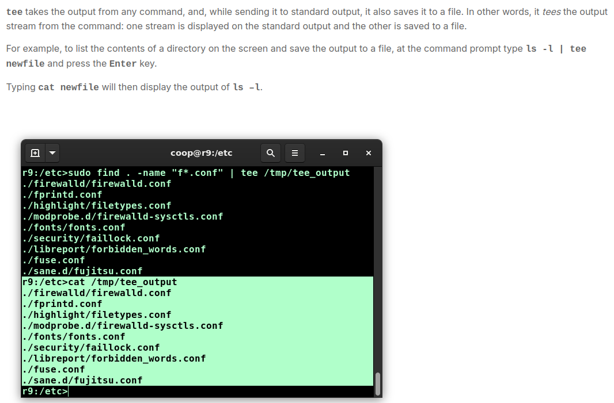

# Some theory


# Filesystem Hierarchy


https://www.youtube.com/watch?v=bbmWOjuFmgA

https://refspecs.linuxfoundation.org/FHS_3.0/fhs-3.0.pdf

https://manpages.ubuntu.com/manpages/jammy/en/man7/file-hierarchy.7.html

https://manpages.ubuntu.com/manpages/jammy/en/man7/hier.7.html

https://help.ubuntu.com/community/LinuxFilesystemTreeOverview


## `/bin/` - Essential user command binaries (for use by all users)

Place for most commonly used terminal commands, like `ls`, `mount`, `rm`, etc.

[More about symlinks to `/usr/bin/`][1]

`/bin` contains commands that may be used by both the `system administrator` and
by `users`, but which are required when no other filesystems are mounted (e.g.
in single user mode). It may also contain commands which are used indirectly by
scripts.

> IMPORTANT: `bin` directory for user defined scripts is under `~/.local/bin`

### Requirements

There must be no subdirectories in `/bin`.

[1]:
  https://manpages.ubuntu.com/manpages/jammy/en/man7/file-hierarchy.7.html#compatibility%20symlinks

## `/etc/` - Host-specific system configuration

The `/etc` hierarchy contains configuration files. A "configuration file" is a
local file used to control the operation of a program; it must be static and
cannot be an executable binary.

`/etc` contains system-global configuration files, which affect the system's
behavior for all users.

### Requirements

No binaries may be located under `/etc`.

The following directories, or symbolic links to directories are required in
`/etc`:

- `opt/` - configuration for `/opt`

## `/home/` - User home directories

`/home` is a fairly standard concept, but it is clearly a site-specific
filesystem. The setup will differ from host to host. Therefore, no program
should assume any specific location for a home directory, rather it should query
for it.

[More about `home`][2]

### Requirements

User specific configuration files for applications are stored in the user's home
directory in a file that starts with the '.' character (a "dot file"). If an
application needs to create more than one dot file then they should be placed in
a subdirectory with a name starting with a '.' character, (a "dot directory").
In this case the configuration files should not start with the '.' character.

[2]:
  https://manpages.ubuntu.com/manpages/jammy/en/man7/file-hierarchy.7.html#home%20directory

## `/opt/` - Add-on application software packages

`/opt` can be used to store additional software for your system, which is not
handled by the package manager.

## `/usr/` - Vendor-supplied operating system resources

`/usr` contains the majority of user utilities and applications, and partly
replicates the root directory structure, containing for instance, among others,
`/usr/bin/` and `/usr/lib`.

> NOTE:  
> `usr` stands for `Unix System Resources`, not `user`!

## `/var/` - Persistent, variable system data

`/var` is dedicated to variable data, such as logs, databases, websites, and
temporary spool (e-mail etc.) files that persist from one boot to the next. A
notable directory it contains is `/var/log` where system log files are kept.

# File permission


## `chmod`


## `chown`


## `chgrp`


# Terminal


## Help

First entry point in `bash`:

```bash
$ help
```

`help` lists internally defined commands. `help` prints short description for
all commands, e.g.:

```bash
$ help help
$ help cd
$ help echo
```

Second entry point:

```bash
$ whatis
```

`whatis` displays one-line man page descriptions with section number. Very
helpful as input for `man` util.

Very similar tool - `aprops` - search man page by keywords, not exact name.

```bash
$ apropos
```

Third entry point:

```bash
$ man
```

`man` prints reference manuals. Good practice is invoke page with section
explicitly:

```bash
$ man man.1
$ man man.7
$ man pwd.1
```

Last entry point:

```bash
$ info
```

Very advanced and very powerful. E.g. search `Print File Information` chapter
for `find` util:

```bash
$ info find -n "Print File Information"
```

## Autocompletion scripts

Autocompletion scripts are located in `/etc/bash_completion.d/`.

Example of generation:

    exercism completion bash | sudo tee /etc/bash_completion.d/exercism.bash-completion

Enable autocompletion in current shell:

    source /etc/bash_completion

## Aliases

Edit `~/.bashrc` file to add alias permamently, eg.

    alias new='gnome-terminal'

## History

    history
    history | tail -10

## Executing previous commands


## Keyboard shortcuts


## Clear console

Command:

    clear

Keyboard shortcut:

    Ctrl + L

## System information

    uname

## Control the systemd system and service manager

    sudo systemctl
    sudo systemctl start gdm  | for starting gnome display manager
    sudo systemctl stop gdm   | for stopping gnome display manager

## SSH client

    ssh
    ssh student@remote-server.com

## Rebooting and Shutting Down

    sudo shutdown

## Locating applications

    which
    whereis

## Accessing directories

    pwd

    cd <dir>  | for specifed dir
    cd        | for home dir
    cd ~      | for home dir (alternative)
    cd ..     | for parent dir
    cd /      | for root dir
    cd -      | for previous viewed dir

    pushd
    popd

## Exploring the file system

    tree                       | travers dirs up
    tree -d                    | only dirs
    tree -L 1 -a --filesfirst  | only first level, all files, sort files first

    ls      | list directory content
    ls -a   | do not ignore entries starting with .
    ls -l   | long list format
    ls -Aliv

## Links

    ln


## Viewing files

    cat
    cat -n  | number non-empty lines

    tac

    less
    less -N

    head
    head -n 15
    head -n 15 | cat -n

    tail
    tail -n 15
    tail -n 15 | cat -n

    wc
    wc --lines
    wc --words
    wc --chars
    wc --bytes


## Creating a File

    touch <filename>
    touch -t <timestamp> <filename>
    touch -t 12091600 <filename>

## Creating a Directory

    mkdir <dirname>

## Moving, Renaming or Removing a File

`mv` does double duty, in that it can:

- simply rename a file,
- move a file to another location, while possibly changing its name at the same
  time.

```
mv <source> <destination>
```

`rm` removes files and directories

    rm <filename>
    rm -i <filename>
    rm -r <filename>

## Moving, Renaming or Removing a File a Directory

`mv` does double duty, in that it can:

- simply rename a directory,
- move a directory to another location, while possibly changing its name at the
  same time.

```
rmdir <dirname>
```

The directory must be empty or the command will fail. To remove a directory and
all of its contents you have to do:

    rm -rf <dirname>

`rmdir` works only on empty directories; otherwise you get an error.

While typing `rm –rf` is a fast and easy way to remove a whole filesystem tree
recursively, it is extremely dangerous and should be used with the utmost care.

## I/O Redirection

Through the command shell, we can redirect the three standard file streams so
that we can get input from either a file or another command, instead of from our
keyboard, and we can write output and errors to files or use them to provide
input for subsequent commands.

For example, we have a program called `cat` that reads from `stdin` and writes
to `stdout` and `stderr`.

If you want to send the output to a file, use the greater-than sign (`>`) as in:

    cat > output-file

You can change its input source by using the less-than sign (`<`) followed by
the name of the file to be consumed for input data:

    cat < input-file

In fact, you can do both at the same time as in:

    cat < input-file > output-file

> NOTE:  
> Using `cat` and I/O redirection we can copy content from `input-file` to
> `output-file`.

Because `stderr` is not the same as `stdout`, error messages will still be seen
on the terminal windows in the above example.

If you want to redirect `stderr` to a separate file, you use `stderr`’s file
descriptor number (`2`), the greater-than sign (`>`), followed by the name of
the file you want to receive everything the running command writes to `stderr`,
e.g.:

    cat --unknown-option 2> error-file

> NOTE:  
> By the same logic, `cat 1> output-file` is the same as `cat > output-file`.

A special shorthand notation can send anything written to file descriptor `2`
(`stderr`) to the same place as file descriptor `1` (`stdout`):

    cat > all-output-file 2>&1

`bash` permits an easier syntax for the above:

    cat &> all-output-file

## Searching for files

    locate <pattern>

> NOTE:  
> `locate` utilizes a database created by a related utility, `updatedb`. Most
> Linux systems run this automatically once a day. However, you can update it at
> any time by just running `sudo updatedb` from the command line as the root
> user. The `locate` command in `Ubuntu` is typically used to find files quickly
> by searching a prebuilt index maintained by the `updatedb` command. However,
> files in the `/tmp` directory are often excluded from the index for
> performance and privacy reasons.

    find <start-dir> <expression>
    find . -name "file*"  | start searching from current working directory
    find / -name "file*"  | start searching from root directory

More advanced oneliner:

    sudo find ~ -path "*asdf*" -prune -o -type d -name "bin" -print

- start searching from the user home dir
- prune result which path contains "asdf"
- print result which path points to directory named "bin"

> NOTE:  
> Use `sudo` in case of presence of problems with permission, e.g. in `tmp`
> dir:  
> `sudo find /tmp -type f -name "*file"`  
> Additionaly, `find` has many `expressions` like removing found files (default
> is `-print`):  
> `sudo find /tmp -type f -name "*file" -delete`

## Comparing files

    diff <filename1> <filename2>

GUIs:

- `diffuse`
- `vimdiff`
- `meld`

## Derermine file type

    file <file> ...

## Compressing data


## Archiving data

- list archive content:

        tar --verbose --list --file arch-name.tar
        tar vtf arch-name.tar

- creating `.tar` archive:

        tar --verbose --create --file arch-name.tar dir-to-arch
        tar vcf arch-name.tar dir-to-arch

- creating `.tar.gz` compressed archive:

        tar --verbose --create --gzip --file arch-name.tar.gz dir-to-arch
        tar vczf arch-name.tar.gz dir-to-arch

- extracting `.tar` or `.tar.gz` archive:

        tar --verbose --extract --file arch-name.tar
        tar vxf arch-name.tar

## Wildcards and Matching Filenames

| Wildcard | Result                                             |
| -------- | -------------------------------------------------- |
| ?        | Matches any single character                       |
| \*       | Matches any string of characters                   |
| [set]    | Matches any character in the set of characters     |
| [!set]   | Matches any character not in the set of characters |

# File manipulation utilities

## `sort`


## `uniq`


## `paste`


## `join`


## `split`


## `grep`


## `strings`


## `tr`


## `cut`


## `tee`



Very useful, when command running and output redirecting have to be divided
because of `non-sudo`/`sudo` privileges. Example:

When it does not work:

    sudo pdm completion bash > /etc/bash_completion.d/pdm.bash-completion

Try:

    pdm completion bash | sudo tee /etc/bash_completion.d/pdm.bash-completion

# Installing software


https://www.debian.org/doc/manuals/debian-faq/pkgtools.en.html

`dpkg` is a package manager for Debian-based systems. It can install, remove,
and build packages, but unlike other package management systems, it cannot
automatically download and install packages – or their dependencies.

`apt` and `aptitude` are newer, and layer additional features on top of `dpkg`.

## `dpkg` - The Debian Package

The Debian Package is the software at the base of the package management system
in the free operating system Debian and its numerous derivatives. `dpkg` is used
to install, remove, and provide information about `.deb` packages.

> NOTE:  
> `dpkg` is the low-level packaging tool that `apt` uses to handle packages.
> Most "normal" user should only use `apt`, because it automatically handles
> dependencies. Only in very special cases, where you want to install a specific
> package, and you don't want to automatically resolve dependencies would you
> use `dpkg`.

> NOTE:  
> Uninstalling packages using `dpkg`, is NOT recommended in most cases. It is
> better to use a package manager that handles dependencies to ensure that the
> system is left in a consistent state. For example, using `dpkg -r zip` will
> remove the `zip` package, but any packages that depend on it will still be
> installed and may no longer function correctly as a result.

### Useful commands

- list all installed packages:

        dpkg --list

  > NOTE:  
  >  Without a pattern, non-installed packages will not be shown.

- list packages, even non-installed:

        dpkg --list vim
        dpkg --list "*vim*"

- list and count only installed packages:

        dpkg --list | grep "^ii" | wc --lines
        dpkg --get-selections | wc --lines

- get info about non-installed `package`, from `.deb` file:

        dpkg --info package.deb
        dpkg --info google-chrome-stable_current_amd64.deb

- get info about installed `package`:

        dpkg --status package
        dpkg --status apt

- list files installed to your system from `package`:

        dpkg --listfiles package
        dpkg --listfiles bash

- show which `package` a file belongs to:

        dpkg --search filename-search-pattern
        dpkg --search /bin/bash

- install a `package` from `.deb` file:

        sudo dpkg --install package.deb

- remove a `package` (but not its configuration files):

        sudo dpkg --remove package

- remove a `package` (including its configuration files):

        sudo dpkg --purge package

## `apt` - The Advanced Packaging Tool

The Advanced Packaging Tool is the underlying package management system that
manages software on Debian-based systems. While it forms the backend for
graphical package managers, such as the `Ubuntu Software Center` and `synaptic`,
its native user interface is at the command line, with programs that include
`apt-get` and `apt-cache`.

> NOTE:  
> The `apt package index` is a database of available packages from the
> repositories defined in the `/etc/apt/sources.list` file and in the
> `/etc/apt/sources.list.d` directory. To update the local package index with
> the latest changes made in the repositories, and thereby access the most
> up-to-date version of the package you’re interested in, type
> `sudo apt update`.

> NOTE:  
> Try to use autocompletion i.e. use `Tab` after type `apt list --` for possible
> options.

### Useful commands

- update local package index:

        sudo apt update

- list all available packages from index:

        apt list
        apt list package

- list installed packages:

        apt list --installed
        apt list --installed package

- list upgradeable packages:

        apt list --upgradeable
        apt list --upgradeable package

- list and count packages:

        apt list --installed | grep "]$" | wc --lines
        apt list --upgradeable | grep "]$" | wc --lines

- search for the given regex term(s) in the list of available packages and
  display matches:

          apt search regex

- show information about the given package(s):

        apt show package

- show dependencies for given `package`:

        apt depends package
        apt rdepends package

- install a `package` from repository:

        sudo apt install <package_1> <package_2> ... <package_n>

- install a `package` from `.deb` file

        sudo apt install /absolute/path/to/package.deb

- install all available upgrades:

        sudo apt upgrade

- remove a `package` (but not its configuration files):

        sudo apt remove <package_1> <package_2> ... <package_n>

- remove a `package` (including its configuration files):

        sudo apt purge <package_1> <package_2> ... <package_n>

- remove no longer needed dependencies:

        sudo apt autoremove

## `aptitude`

Additional feature comparing to `dpkg` and `apt`:

    aptitude why package
    aptitude why-not package

## `synaptic`

https://help.ubuntu.com/community/SynapticHowto

## `apt` vs `apt-get` / `apt-cache`

For basic commands the syntax of the tools is identical.

While `apt` is a command-line tool, it is intended to be used interactively, and
not to be called from non-interactive scripts. The `apt-get` command should be
used in scripts (perhaps with the `--quiet` flag).

## Installed software locations

### System packages

https://manpages.ubuntu.com/manpages/jammy/en/man7/file-hierarchy.7.html#system%20packages

### User packages

https://manpages.ubuntu.com/manpages/jammy/en/man7/file-hierarchy.7.html#user%20packages

## Useful commands

## Cheat sheets


https://www.debian.org/doc/manuals/debian-reference/ch02.en.html#_basic_package_management_operations_with_the_commandline

https://www.debian.org/doc/manuals/debian-reference/ch02.en.html#_advanced_package_management_operations_with_commandline

https://www.debian.org/doc/manuals/refcard/refcard.en.pdf

# Text editors


## `vim`


# User environment

## Identifying the Current User

    whoami
    who

Linux is a multi-user operating system, meaning more than one usercan log on at
the same time.

To identify the current user, type `whoami`.

To list the currently logged-on users, type `who`.

Giving `who` the `-a` option will give more detailed information.

## Startup files


### Evaluating `.bashrc` startup file

    source ~/.bashrc

## Environment Variables

### Listing

    set
    env
    export

### Setting


### HOME variable


### PATH variable


Use the following command to display the `PATH` variable in more readable way:

    echo $PATH | tr ":" "\n" | sort

Paths from `PATH` variable comes from various scripts and startup files, i.e.:

- `login` and variables derived from the `/etc/login.defs` config file (see
  more: `man login.1`)

- `pam_env` and variables derived from the `/etc/security/pam_env.conf`,
  `/etc/environment`, `~/.pam_environment` config files (see more:
  `man pam_env.7`)

- `/etc/profile` and scripts coming from `/etc/profile.d/`

- `~/.profile`

- `~/.bashrc`

### SHELL variable


# Processes

## GUIs

- System Monitor

## Theory


# Resources

https://refspecs.linuxfoundation.org/

https://www.debian.org/intro/index.en.html

https://manpages.ubuntu.com/

https://man7.org/linux/man-pages/

https://linuxcommand.org/index.php

# Installed software

    sudo apt update
    sudo apt upgrade
    cd /tmp
    sudo find / -path /proc -prune -o -print > bef

    # Install package

    sudo find / -path /proc -prune -o -print > aft
    diff bef aft

## `JetBrains Toolbox`

Instructions:

https://www.jetbrains.com/help/idea/installation-guide.html#toolbox

Installer:

https://www.jetbrains.com/toolbox-app/

    # Install dependencies.
    sudo apt install libfuse2

    # Download toolbox installer.

    cd ~/Downloads/
    tar -vxf jetbrains-toolbox-<build>.tar.gz
    cd jetbrains-toolbox-<build>
    ./jetbrains-toolbox

### Redirect output do /dev/null and run in subshell


## `Jet Brains IDEs`

Install using JetBrains Toolbox.

### Settings sync

https://www.jetbrains.com/help/pycharm/sharing-your-ide-settings.html

## `Visual Studio Code`

https://code.visualstudio.com/Download

### Settings sync

https://code.visualstudio.com/docs/editor/settings-sync

## `asdf`

Instructions:

https://asdf-vm.com/guide/getting-started.html#getting-started

    # Install ependencies.
    sudo apt install curl git

    # Core installation.
    git clone https://github.com/asdf-vm/asdf.git ~/.asdf --branch v0.15.0

    # Add the following to ~/.bashrc:
    . "$HOME/.asdf/asdf.sh"
    . "$HOME/.asdf/completions/asdf.bash"

    # Evaluate startup file.
    source ~/.bashrc

## `elixir`

Manage versions using `asdf`.

asdf plugin:

https://github.com/asdf-vm/asdf-elixir

    # Install plugin's dependencies.
    sudo apt install unzip

    # Install plugin.
    asdf plugin add elixir https://github.com/asdf-vm/asdf-elixir.git
    asdf plugin list --ulrs

    # List available versions.
    asdf list all elixir

    # List already installed versions.
    asdf list elixir

    # Install specified version.
    asdf install elixir X.X

## `erlang`

Manage versions using `asdf`.

asdf plugin:

https://github.com/asdf-vm/asdf-erlang

    # Install plugin's dependencies.
    sudo apt install install build-essential autoconf m4 libncurses5-dev \
    libwxgtk3.0-gtk3-dev libwxgtk-webview3.0-gtk3-dev libgl1-mesa-dev \
    libglu1-mesa-dev libpng-dev libssh-dev unixodbc-dev xsltproc fop \
    libxml2-utils libncurses-dev openjdk-11-jdk

    # Install plugin.
    asdf plugin add erlang https://github.com/asdf-vm/asdf-erlang.git
    asdf plugin-list --ulrs

    # List available versions.
    asdf list all erlang

    # Install latest version.
    asdf install erlang latest

    # Install specified version.
    asdf install erlang X.X

## `python`

Manage versions using `asdf`.

asdf plugin:

https://github.com/asdf-community/asdf-python

    # Install plugin's dependencies.
    sudo apt install build-essential libssl-dev zlib1g-dev libbz2-dev \
    libreadline-dev libsqlite3-dev curl git libncursesw5-dev xz-utils tk-dev \
    libxml2-dev libxmlsec1-dev libffi-dev liblzma-dev

    # Install plugin.
    asdf plugin add python
    asdf plugin list --ulrs

    # List available versions.
    asdf list all python

    # List already installed versions.
    asdf list python

    # Install specified version.
    asdf install python X.X

## `pdm`

Manage versions using `asdf`.

https://pdm-project.org/en/latest/#other-installation-methods

> NOTE:  
> Check current python version before installation: `asdf current python`

## `pipx`

    python -m pip install --user pipx
    python -m pipx ensurepath

> NOTE:  
> Check current python version before installation: `asdf current python`

## `git`

Instructions:

https://git-scm.com/book/en/v2/Getting-Started-Installing-Git#_installing_from_source

```
sudo apt-get install dh-autoreconf libcurl4-gnutls-dev libexpat1-dev gettext \
libz-dev libssl-dev asciidoc xmlto docbook2x install-info

cd Downloads/

tar -vxf git-2.47.1.tar.gz

cd git-2.47.1/

make configure

./configure --prefix=/usr

make all doc info

sudo make install install-doc install-html install-info
```

## `GitHub CLI`

https://github.com/cli/cli/blob/trunk/docs/install_linux.md#debian-ubuntu-linux-raspberry-pi-os-apt

## `Thunderbird`

    sudo apt install thunderbird

## `gnome-screenshot`

    sudo apt install gnome-screenshot

## `gnome-shell-extension-manager` aka `Extension Manager`

    sudo apt install gnome-shell-extension-manager

### `Dash to Panel`

Using `Extension Manager`.

## `gnome-tweaks` aka `Tweaks`

    sudo apt install gnome-tweaks
